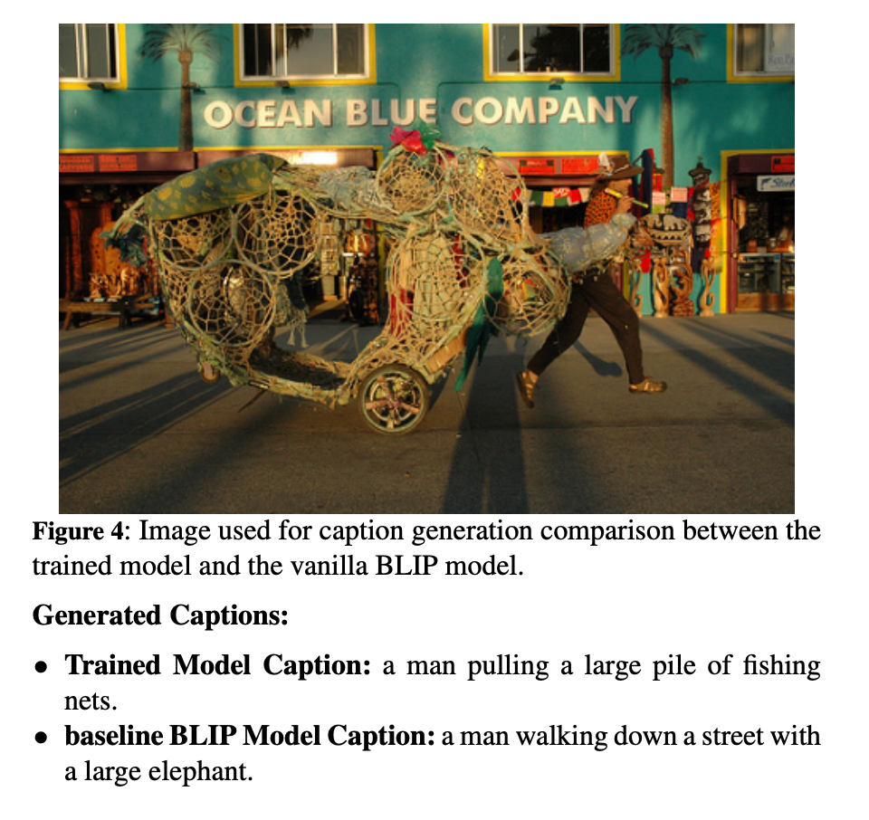

https://www.researchgate.net/publication/387270932_Semantic_Refinement_and_Visual_Alignment_for_Improved_Image_Captioning


# **Semantic Refinement and Visual Alignment for Improved Image Captioning**

## **Overview**
This project explores an enhanced **image captioning** framework that improves the **semantic richness and visual alignment** of generated captions. We integrate a **Caption Refinement Network** and a **Semantic Alignment Layer** into the **BLIP (Bootstrapped Language-Image Pretraining)** model, leading to more **contextually grounded** and **descriptive** captions.

By leveraging these mechanisms, we achieve **significant improvements** in captioning performance over the baseline BLIP model.

## **Key Features**
- **Caption Refinement Network**: Enhances the quality of text representations before final caption generation.
- **Semantic Alignment Layer**: Ensures stronger grounding between image features and generated text.
- **BLIP Model Integration**: Uses a powerful vision-language pretraining framework to improve captioning performance.
- **Performance Gains**: Achieves notable improvements on **Flickr8k** dataset:
  - **ROUGE-L**: +3.02%
  - **METEOR**: +3.98%
  - **CIDEr**: +16.08%

## **Example output**


## **Dataset**
- **Flickr8k Dataset**: Contains **8,000 images** with **five human-written captions per image**.
- Dataset is preprocessed with **image resizing and tokenization** to match BLIP model input requirements.

## **Methodology**
1. **BLIP Backbone**: The model starts with **BLIP’s vision-language pretraining**, which encodes images into latent feature representations.
2. **Caption Refinement Network**:
   - Improves intermediate text embeddings.
   - Uses **multi-head self-attention** to enhance semantic coherence.
3. **Semantic Alignment Layer**:
   - Cross-attention mechanism aligns text and image representations.
   - Ensures captions are **contextually accurate** and **grounded in visual data**.
4. **Training Strategy**:
   - **Loss function**: Cross-entropy loss applied to predicted captions.
   - **Optimization**: AdamW optimizer with learning rate **1×10⁻⁵**.
   - **Training on Flickr8k**: Model trained for **14 epochs**, batch size **16**.
   - **Inference Optimization**: Refinement & alignment layers are **only used during training**, reducing computational overhead during inference.

## **Results**
| Metric  | Trained Model | BLIP Baseline | Improvement |
|---------|--------------|--------------|------------|
| ROUGE-1 | **0.4157**   | 0.3795       | **+9.6%**  |
| ROUGE-2 | **0.1549**   | 0.1317       | **+17.6%** |
| ROUGE-L | **0.3889**   | 0.3587       | **+8.4%**  |
| METEOR  | **0.1633**   | 0.1236       | **+32.1%** |
| CIDEr   | **0.6706**   | 0.5078       | **+32.0%** |

### **Qualitative Evaluation**
- The trained model generates captions that are **more descriptive and contextually accurate**.
- Example:
  - **Trained Model:** `"A man pulling a large pile of fishing nets."`
  - **Baseline Model:** `"A man walking down a street with a large elephant."` _(Incorrect objects detected)_

## **Installation & Usage**
### **1. Clone the Repository**
```bash
git clone https://github.com/yourusername/image-captioning-blip.git
cd image-captioning-blip
```
### **2. Install Dependencies**
```bash
pip install -r requirements.txt
```
### **3. Run the Jupyter Notebook**
Open the provided .ipynb file in Jupyter Notebook or Google Colab and execute the cells to train and test the model.

## **Future Work**
- Extend the methodology to larger datasets (e.g., MS COCO).
- Explore multi-modal learning for video captioning.
- Incorporate explainability techniques to improve model interpretability.
